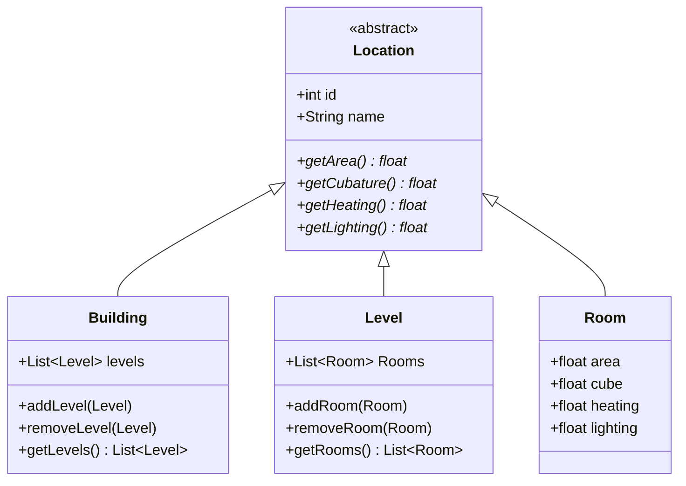

# Building Info
## SE-2023-Sprint1

----

# Description

For building administrators who want to minimise the costs of building management, our Building Info application will enable obtaining information about building parameters at the level of rooms, floors and entire buildings. The application will be available via GUI and also as a remote API, thanks to which it can be integrated with existing tools. 

# Data structure

